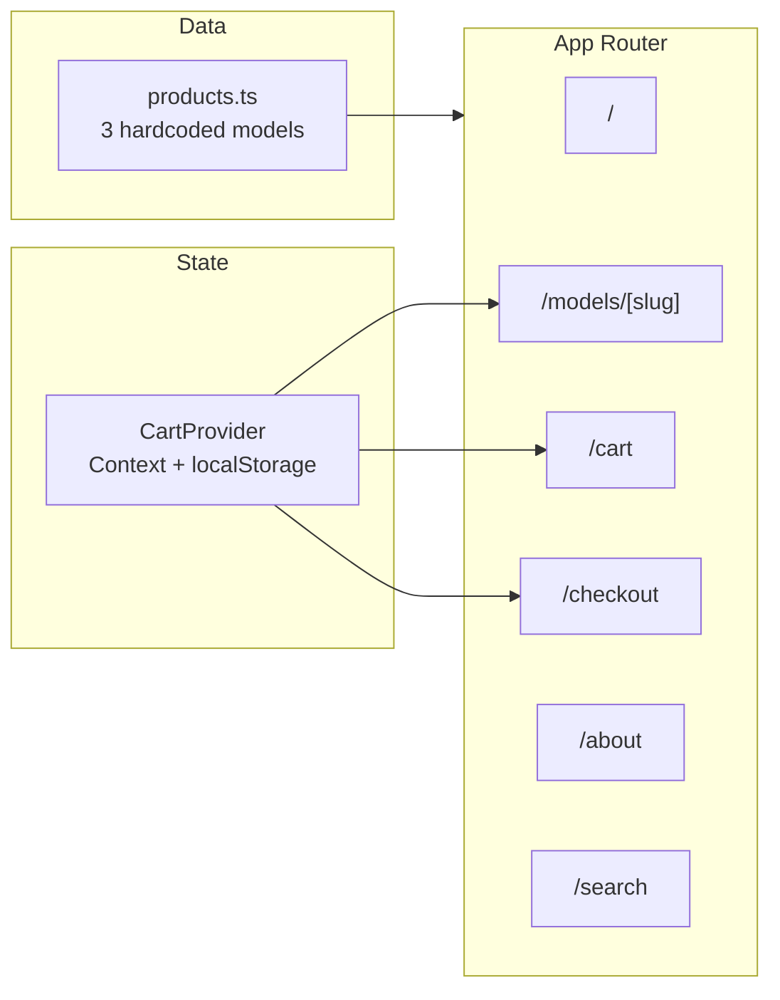

# Homebot Mock E-Commerce Website – Implementation Plan

## Architecture Overview




---

## 1. Project Setup

- **Initialize**: Next.js 14 with App Router, TypeScript, Tailwind CSS, Node 20 (via `engines` in `package.json`).
- **Config**: `next.config.js` (minimal; only if needed for Render), `tailwind.config.ts`, `postcss.config.js`, `tsconfig.json`.
- **Scripts** in `package.json`: `dev` (`next dev`), `build` (`next build`), `start` (`next start`).
- **Layout**: Root layout in `app/layout.tsx` with `<Navbar />`, `{children}`, `<Footer />`; global Tailwind in `app/globals.css`.

---

## 2. Data Layer

- **Single source of truth**: `[src/data/products.ts](src/data/products.ts)` exporting an array (or map) of products with:
  - `id`, `slug` (x1 | x2 | x3), `name`, `price` (number), `capabilities` (string or string[]), optional `image` placeholder.
- Hardcode exactly:
  - **X1**: slug `x1`, “clears floors like a modern robot vacuum cleaner”, $399.
  - **X2**: slug `x2`, “clears floors + can also wash dishes”, $899.
  - **X3**: slug `x3`, “clears floors + washes dishes + does laundry + cleans windows”, $1499.
- Helper: `getProductBySlug(slug)`, `getAllProducts()` for listing and search.

---

## 3. Cart State (Context + localStorage)

- **Provider**: `src/context/CartContext.tsx` (or `context/cart.tsx`).
  - State: array of `{ productId/slug, quantity }`.
  - On mount: hydrate from `localStorage` (key e.g. `homebot-cart`).
  - On change: persist to `localStorage`.
  - Methods: `addItem(slug, qty?)`, `removeItem(slug)`, `updateQuantity(slug, qty)`, `clearCart()`, plus derived `items` (with product details from `products.ts`), `itemCount`, `subtotal`.
- **Hook**: `useCart()` that uses this context; throw or return null if used outside provider.
- Wrap app in `CartProvider` in root layout.

---

## 4. Shared Components


| Component       | Location                     | Responsibility                                                                                                                                              |
| --------------- | ---------------------------- | ----------------------------------------------------------------------------------------------------------------------------------------------------------- |
| **Navbar**      | `components/Navbar.tsx`      | Logo (text “Homebot”), Models link/dropdown, Cart link with `useCart().itemCount` badge.                                                                    |
| **Footer**      | `components/Footer.tsx`      | Search form (input + submit → `router.push('/search?q=' + encodeURIComponent(q))`), “About us” → `/about`, copyright.                                       |
| **ProductCard** | `components/ProductCard.tsx` | Props: product; shows name, short capabilities, price, “View model” (link to `/models/[slug]`), “Add to cart” (calls `addItem`). Reused on home and search. |
| **Layout**      | `app/layout.tsx`             | Wraps children with `CartProvider`, Navbar, Footer; metadata.                                                                                               |


Use semantic HTML and Tailwind; ensure buttons/inputs are focusable and labeled (a11y).

---

## 5. Pages (App Router)

- **Home** `app/page.tsx`
  - Hero: headline + tagline; CTA “Shop Models” that scrolls to `#models` (same page).
  - Section `id="models"`: three `<ProductCard>` for X1, X2, X3 (data from `getAllProducts()`).
- **Model pages** `app/models/[slug]/page.tsx`
  - `getProductBySlug(params.slug)`; 404 if not found.
  - Breadcrumb: Home → Model name.
  - Large image placeholder (e.g. SVG or styled div).
  - Feature list (bullets from capabilities).
  - Price, “Add to cart”.
  - Comparison strip: links to the other two model slugs.
- **Cart** `app/cart/page.tsx`
  - Line items: name, price, quantity (+ / −), remove.
  - Subtotal, estimated tax (e.g. 8%), total.
  - “Continue shopping” → `/`, “Checkout” → `/checkout` (disabled if cart empty).
- **Checkout** `app/checkout/page.tsx`
  - Order summary (same totals as cart).
  - Form: name, email, address (required); basic client-side validation.
  - “Place order”: on submit → show success message, `clearCart()`, link “Back to Home” → `/`. No API or payment.
- **About** `app/about/page.tsx`
  - Static content: short “About us” copy (placeholder text acceptable).
- **Search** `app/search/page.tsx`
  - Read `searchParams.q`; filter products by name and capabilities (case-insensitive match).
  - Render result cards with `<ProductCard>`; handle empty state (“No results”).

---

## 6. Styling and UX

- Tailwind only; no extra CSS framework. Clean spacing, simple typography, consistent buttons/inputs.
- Responsive: navbar collapses or stays compact on small screens; cards stack on mobile.
- No dark mode required unless specified; single theme is fine.

---

## 7. Deployment (Render)

- `**render.yaml**` at repo root:
  - One service: type `web`, build command `npm install && npm run build`, start command `npm start`.
  - Node version 20 (via env or Render’s runtime).
- **README.md**:
  - Local: `npm install`, `npm run dev` (and optional `npm run build` / `npm start`).
  - Deploy: connect repo, use “Blueprint” and point to `render.yaml`, or add Web Service with same build/start.
  - Environment variables: “None required.”
- No env vars needed for the app; no `.env` in repo unless optional (e.g. future analytics).

---

## 8. File and Folder Structure (Key Paths)

```
/
├── render.yaml
├── README.md
├── package.json
├── next.config.js
├── tailwind.config.ts
├── postcss.config.js
├── tsconfig.json
├── src/
│   ├── data/
│   │   └── products.ts
│   ├── context/
│   │   └── CartContext.tsx
│   ├── components/
│   │   ├── Navbar.tsx
│   │   ├── Footer.tsx
│   │   └── ProductCard.tsx
│   └── app/
│       ├── layout.tsx
│       ├── globals.css
│       ├── page.tsx
│       ├── cart/
│       │   └── page.tsx
│       ├── checkout/
│       │   └── page.tsx
│       ├── about/
│       │   └── page.tsx
│       ├── search/
│       │   └── page.tsx
│       └── models/
│           └── [slug]/
│               └── page.tsx
```

---

## 9. Validation Checklist (from design)

- All routes work: `/`, `/models/x1|x2|x3`, `/cart`, `/checkout`, `/about`, `/search?q=...`
- Cart persists across refresh (localStorage) and clears on “Place order”
- Footer search submits to `/search?q=...` and results use same ProductCard as home
- Checkout form: required name, email, address; success state clears cart and links home
- No database, no Stripe, no auth
- `npm run dev` and `npm run build` / `npm start` work; Render deploys via `render.yaml`

This plan satisfies the design doc’s goals, tech stack, IA/routes, product data, and deployment requirements.